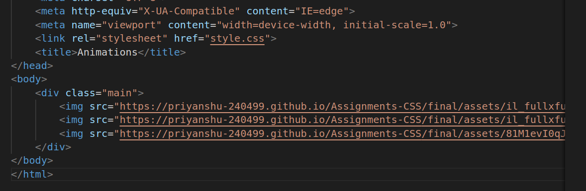
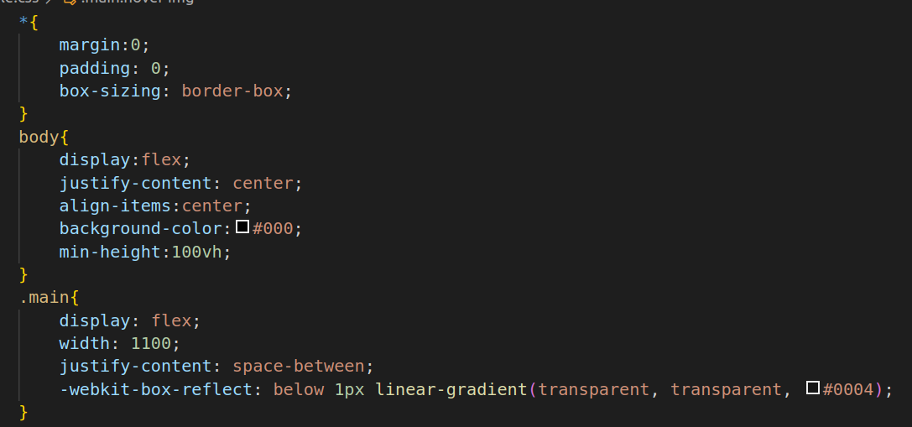
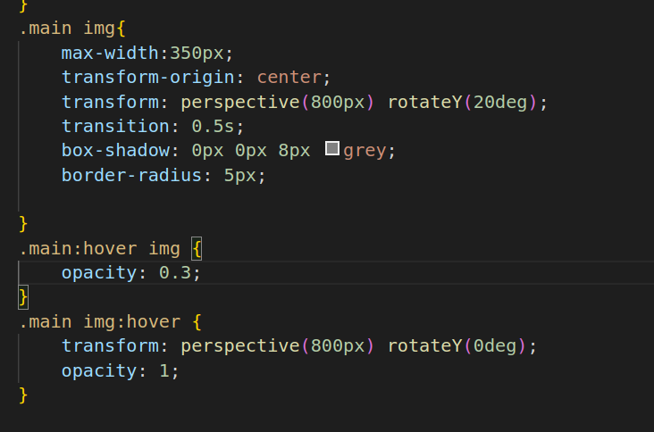

# Animations
1.

* link rel="stylesheet" href="style.css": This link tag links an external CSS stylesheet named "style.css" to the HTML document. The stylesheet is used to apply styles and layout to the HTML content.
* title Animations: This title tag sets the title of the web page to "Animations," which is displayed in the browser's title bar or tab.
* body: The body section contains the main content of the web page. Inside it, you have:
* div class="main": This is a div element with the class attribute "main." It serves as a container for the images that follow.
* img src="URL" alt="watch-image": These img tags are used to display images on the webpage. Each img tag has a src attribute that specifies the URL of the image to be displayed, and an alt attribute that provides alternative text for the image, which is helpful for accessibility and SEO.
* The first img tag displays a watch image with the specified URL.
* The second img tag displays another watch image with a different URL.
* The third img tag displays a third watch image with a different URL.

2.

3.

* *(Universal Selector):margin: 0;, padding: 0;, box-sizing: border-box;: These properties reset the default margin and padding of all elements to zero and set the box-sizing to border-box. It's a common practice to provide a consistent starting point for styling elements.
* body:display: flex;: Makes the body a flex container, allowing for flexible layout control.
* justify-content: center;: Horizontally centers the content within the flex container.
* align-items: center;: Vertically centers the content within the flex container.
* background-color: #000;: Sets the background color of the body to black (#000).
* min-height: 100vh;: Ensures that the body occupies at least the full viewport height (100vh), ensuring that the content is vertically centered.
* container:display: flex;: Makes the container a flex container, allowing its children to be spaced accordingly.
width: 1100;: This value should have a unit (e.g., px or rem) like width: 1100px;. Specifies the width of the container.
-webkit-box-reflect: below 1px linear-gradient(transparent, transparent, #0004);: This is a WebKit-specific property for creating a reflection effect below the container. The reflection is a linear gradient that goes from transparent to transparent to semi-transparent black (#0004).
* container img:max-width: 350px;: Sets the maximum width of images within the container to 350 pixels.
* transform-origin: center;: Defines the transform origin at the center of the image.
* transform: perspective(800px) rotateY(20deg);: Applies a 3D transform to rotate the image along the Y-axis by 20 degrees with a perspective effect.
* transition: 0.5s;: Adds a smooth transition effect over 0.5 seconds to the transform property.
* box-shadow: 0px 0px 8px grey;: Adds a gray box shadow to the image.
* border-radius: 5px;: Rounds the corners of the image with a 5-pixel border radius.
* container:hover img:opacity: 0.3;: Reduces the opacity of the image to 0.3 when hovering over the container.
* container img:hover:transform: perspective(800px) rotateY(0deg);: Returns the image to its original state when hovering over the image itself.
opacity: 1;: Restores full opacity to the image on hover.

# HostedLink

https://nikhitha5511.github.io/Animation/?authuser=0
